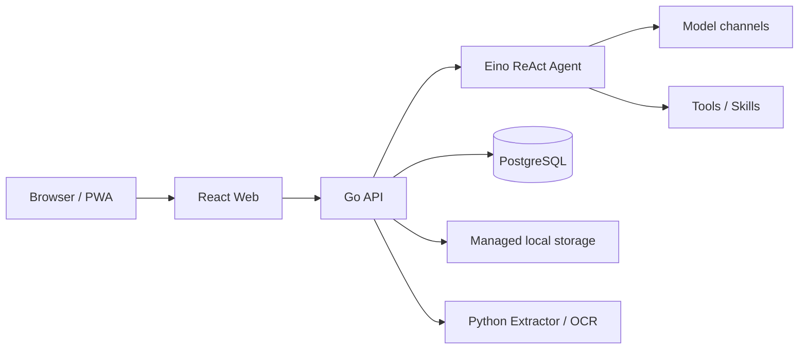

<p align="center">
  
</p>

<h1 align="center">EffChat</h1>

<p align="center">
  A lightweight, self-hosted AI agent workbench built for real workflows.
</p>

<p align="center">
  <a href="README.md">中文</a> · <strong>English</strong>
</p>

<p align="center">
  <a href="https://github.com/huoguojun123/EffChat/actions/workflows/ci.yml"></a>
  <a href="https://github.com/huoguojun123/EffChat/releases"></a>
  <a href="LICENSE"></a>
  
  
</p>

EffChat is designed for individuals and small teams that want control over their models, data, and runtime. It stays simple to deploy and quiet to use without pretending that an agent is only a chat box: streams recover after disconnects, answer versions remain selectable, long conversations can be compacted without erasing history, and files, memory, and web tools all have explicit lifecycle and failure semantics.

> [!WARNING]
> The current release is `v0.3.4-beta.3`. EffChat is still beta software. Create a consistent backup before upgrading; migrations, configuration compatibility, and public APIs may change in later prereleases.

## Why EffChat

### A conversation is more than one HTTP request

- **Runs survive disconnects:** backend execution continues and persists after the browser disconnects, then recovers through RunHub and PostgreSQL.
- **Answers remain comparable:** multiple attempts for the same turn are persisted, selectable, and removable. The selected attempt is the one sent into future context.
- **Retries do not duplicate facts:** zero-output transient failures can retry safely; once text, reasoning, or tool output exists, the provider call is not silently replayed.
- **Compaction does not erase history:** checkpoints change the model context while keeping the original conversation visible to the user.

### Files are part of the agent workflow

- Uploads, staged ownership, extracted text, session files, previews, and authenticated downloads share one ownership boundary.
- An isolated Python sidecar handles common documents and spreadsheets. PDF workflows can use MinerU OCR with local parsing as a fallback.
- Large files are read in bounded windows, and extraction, OCR, deletion, and cleanup expose explicit states instead of feeding partial content to the agent.

### Memory stays deliberately scoped

- Memory is scoped to one conversation. EffChat does not build cross-session profiles, a vector database, or implicit RAG.
- Automatic maintenance, manual organization, retries, change history, and undo are supported.
- Passwords, tokens, authorization values, and private keys are protected before storage and before old memory is sent back to a model.

### Web capabilities are independently governed

- Search and webpage extraction are separate tool chains with independent ordering, enablement, and quotas.
- Firecrawl, Jina, Tavily Extract, Exa Extract, and other configured providers run in administrator order; credential-free Basic extraction remains the final local fallback.
- Long pages are locally filtered for relevant content first. Model refinement is optional, and failures fall back to relevant source passages instead of a naive prefix truncation.

### Models, tools, and quotas stay visible

- Supports OpenAI-compatible Chat Completions, OpenAI Responses, Anthropic native, and Google native adapters.
- Models, channels, Tools, Skills, web services, user groups, quotas, fonts, and system settings are managed from the admin UI.
- Messages, model tokens, tools, search, extraction, and OCR share consistent usage accounting without pretending to be a commercial billing system.

## Architecture at a glance



- **Backend:** Go, Gin, Eino
- **Frontend:** React 19, TypeScript, Vite, Tailwind CSS v4
- **Database:** PostgreSQL
- **Extractor:** isolated Python sidecar
- **Deployment:** Docker Compose

See [ARCHITECTURE.md](ARCHITECTURE.md) for the complete design and runtime invariants.

<!--
Screenshot slots: place real, sanitized images in docs/assets/screenshots/ and
uncomment this block. Suggested names are
chat-workspace.webp, file-and-tools.webp, and admin-settings.webp.
Never commit real users, production URLs, credentials, or private data.

## Screenshots


-->

## Quick start

### One-command personal install

The installer downloads the matching Compose template and migrations, creates local random secrets, pulls the published images, and starts EffChat.

```bash
curl -fsSL https://raw.githubusercontent.com/huoguojun123/EffChat/main/scripts/install.sh | bash
```

Open `http://127.0.0.1:8088`. To choose another installation directory:

```bash
curl -fsSL https://raw.githubusercontent.com/huoguojun123/EffChat/main/scripts/install.sh | EFFCHAT_HOME=/srv/effchat bash
```

Existing configuration or data directories are never overwritten.

### Standard Docker Compose

For users who want to manage directories, environment variables, ports, upgrades, and backups themselves:

```bash
git clone https://github.com/huoguojun123/EffChat.git
cd EffChat
cp .env.docker.example .env.docker
# Replace at least POSTGRES_PASSWORD and JWT_SECRET
docker compose --env-file .env.docker -f docker-compose.registry.yml pull
docker compose --env-file .env.docker -f docker-compose.registry.yml up -d
```

To build locally instead, run `scripts/docker-build.sh up` after copying the environment template.

Open `http://localhost:8088`. The first account registered on a fresh instance becomes the administrator and can configure model channels, web services, tools, user groups, and file policies.

See [Docker Compose deployment](docs/deployment.md) for upgrades, backups, recovery, data directories, and reverse proxy configuration.

## Documentation

Most project documentation is maintained in Chinese so there is one authoritative operational description.

- [Administrator configuration](docs/administration.md)
- [Docker Compose deployment](docs/deployment.md)
- [Architecture](ARCHITECTURE.md)
- [Contributing](CONTRIBUTING.md)
- [Database migrations](backend/migrations/README.md)
- [Changelog](CHANGELOG.md)

## Current boundaries

EffChat currently focuses on being a self-hosted agent workbench. It does not include a code-execution sandbox, shell tool, browser automation, full RBAC, commercial billing, or a Skills marketplace. These capabilities materially expand the security and deployment boundary and will not be hidden behind ungoverned switches in the main process.

## Security and contributing

- Report vulnerabilities privately through [GitHub Private Vulnerability Reporting](https://github.com/huoguojun123/EffChat/security/advisories/new), not a public issue.
- Read [CONTRIBUTING.md](CONTRIBUTING.md) before opening a bug report, feature request, or pull request.
- Never include real credentials, production logs, user data, or private deployment information in examples, tests, or issues.

## License

EffChat's original source code is licensed under the [Apache License 2.0](LICENSE). Third-party dependencies, prompts, and assets remain under their respective terms; see [THIRD_PARTY_NOTICES.md](THIRD_PARTY_NOTICES.md) and [NOTICE](NOTICE). Release images also include component-level license archives generated from the dependencies actually distributed.

Maintainers should follow the [release checklist](docs/release-checklist.md).
