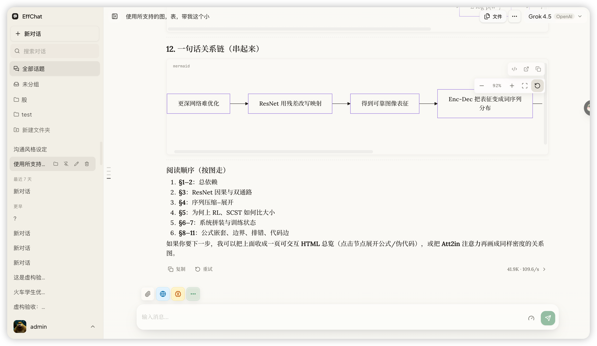
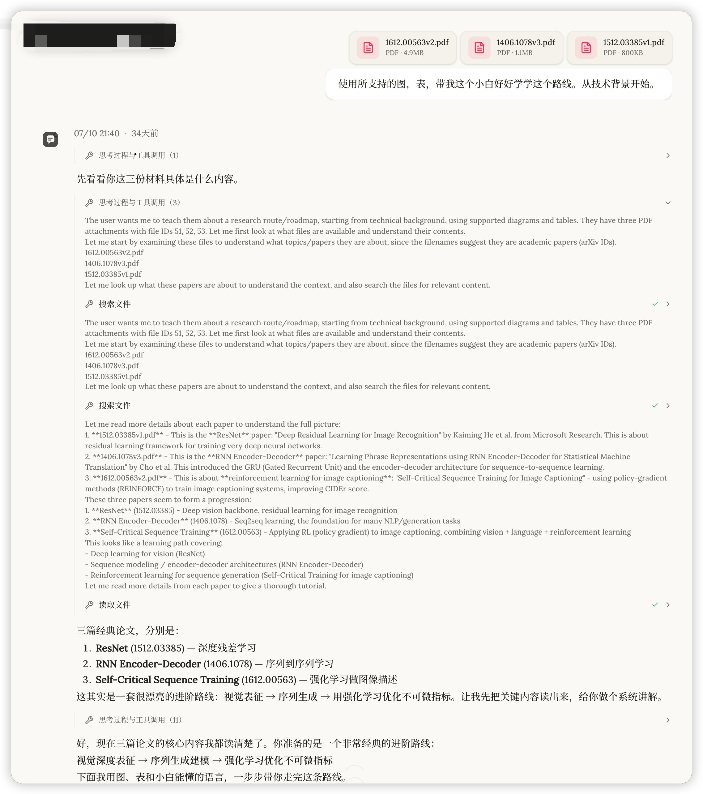
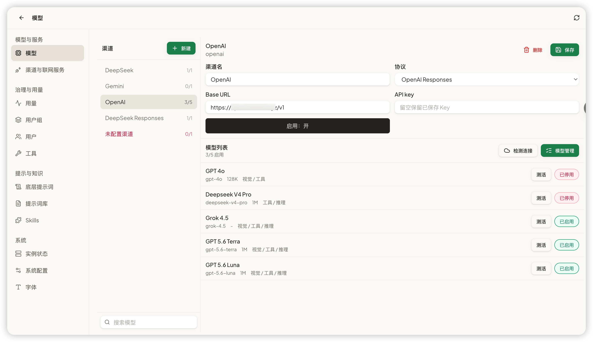
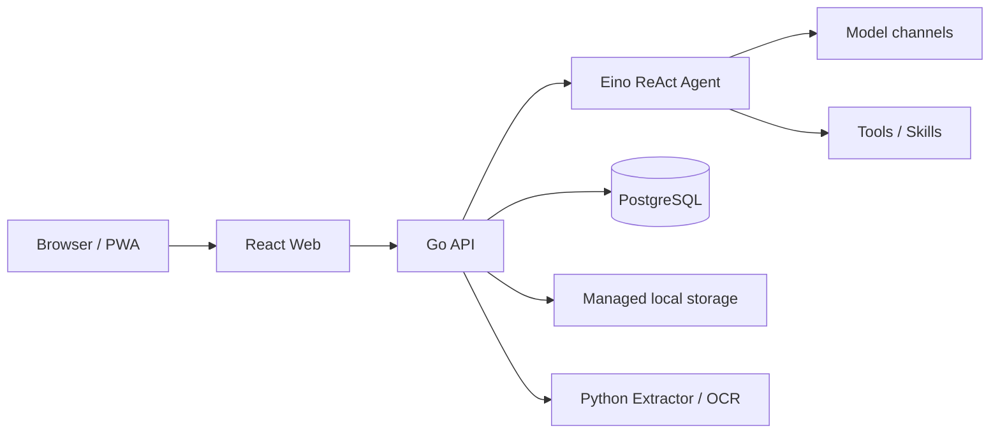

<p align="center">
  
</p>

<h1 align="center">EffChat</h1>

<p align="center">
  A self-hosted agent workbench that keeps models, data, and runtime under your control.
</p>

<p align="center">
  <a href="README.md">中文</a> · <strong>English</strong>
</p>

<p align="center">
  <a href="https://github.com/huoguojun123/EffChat/actions/workflows/ci.yml"></a>
  <a href="https://github.com/huoguojun123/EffChat/releases"></a>
  <a href="LICENSE"></a>
  
  
</p>

<p align="center">
  <a href="#quick-start">Quick start</a> ·
  <a href="#interface-preview">Preview</a> ·
  <a href="#capabilities-at-a-glance">Features</a> ·
  <a href="#documentation-map">Docs</a>
</p>

EffChat is designed for individuals and small teams that want control over their models, data, and runtime boundaries. It stays simple to deploy and quiet to use while treating the difficult parts behind a chat box as first-class product behavior: streaming run recovery, selectable answer attempts, context compaction that preserves history, and explicit lifecycles for files, memory, web tools, and governance settings.

> [!WARNING]
> EffChat is still beta software. Create a consistent backup before upgrading; migrations, configuration compatibility, and public APIs may change in later prereleases.

## Capabilities at a glance

| Area | What EffChat provides |
| --- | --- |
| Conversations and recovery | Eino ReAct Agent, streamed reasoning and tools, continued execution after disconnects, refresh recovery, safe zero-output retries |
| Answers and context | Multiple answer attempts per turn, selection and deletion, selected-attempt context, database checkpoints, preserved pre-compaction history |
| Files and understanding | Upload ownership, PDF/Office/Markdown/spreadsheet extraction, original images and vision input, preview and authenticated download, optional OCR, bounded large-file reads |
| Memory | Conversation-scoped structured memory, automatic maintenance, manual organization, retries, change history, undo, sensitive-value protection |
| Web tools | Separately governed search and extraction, ordered providers, local Basic fallback, long-page selection, optional model refinement |
| Models and governance | Multiple model protocols, Tools/Skills, user groups, quotas, usage, file policies, web services, fonts, and instance status |

## Interface preview

<p align="center">
  <a href="docs/assets/screenshots/chat-workspace.png">
    
  </a><br>
  <sub>Chat workspace: streaming answers, Markdown and Mermaid previews, conversation organization, and run state in one view.</sub>
</p>

<p align="center">
  <a href="docs/assets/screenshots/file-and-tools.png">
    
  </a><br>
  <sub>Files and tools: upload several PDFs, then let the Agent search, read, and expose a traceable tool run.</sub>
</p>

<p align="center">
  <a href="docs/assets/screenshots/admin-settings.png">
    
  </a><br>
  <sub>Administration: configure protocols, channels, model capabilities, enablement, and connection checks.</sub>
</p>

Click an image to inspect its original resolution. Screenshots use demonstration content or sanitized settings and are not production configuration templates.

## Key design choices

### A conversation is more than one HTTP request

- **Runs survive disconnects:** backend execution continues and persists after the browser disconnects, then recovers through RunHub and PostgreSQL.
- **Answers remain comparable:** multiple attempts for the same turn are persisted, selectable, and removable. The selected attempt is the one sent into future context.
- **Retries do not duplicate facts:** zero-output transient failures can retry safely; once text, reasoning, or tool output exists, the provider call is not silently replayed.
- **Compaction does not erase history:** checkpoints change model context while keeping the original conversation visible. Recent messages remain within a bounded budget, and oversized content is reduced at explicit boundaries.

### Files are part of the agent workflow

- Uploads, staged ownership, extracted text, session files, previews, and authenticated downloads share one ownership boundary.
- An isolated Python sidecar handles common documents and spreadsheets. Original images remain managed attachments for vision-capable models, and PDF workflows can use MinerU OCR with local parsing as a fallback.
- Large files are read in bounded windows, and extraction, OCR, deletion, and cleanup expose explicit states instead of feeding partial content to the Agent.
- Administrators govern file size, page count, extraction concurrency, OCR, and retention centrally rather than through scattered client settings.

### Memory stays scoped and reversible

- Memory belongs to one conversation. EffChat does not build cross-session profiles, a vector database, or implicit RAG.
- Automatic maintenance, manual organization, retries, change history, and undo are supported; maintenance runs are accounted separately from normal messages.
- Passwords, tokens, authorization values, and private keys are protected before storage and before old memory is sent back to a model.

### Search and webpage extraction are governed separately

- Search and webpage extraction are independent tool chains with separate ordering, enablement, and quotas.
- Firecrawl, Jina, Tavily Extract, Exa Extract, and other configured providers run in administrator order; credential-free Basic extraction is the final local fallback.
- Basic extraction uses main-content parsing and relevant-passage selection for long pages. Model refinement is optional, and failures fall back to relevant source passages instead of a naive prefix truncation.
- Cancellation, timeout, restricted content, and degraded results remain explicit; challenge pages and empty bodies are not presented as successful extraction.

### Models, tools, and quotas stay visible

- Supports OpenAI-compatible Chat Completions, OpenAI Responses, Anthropic native, and Google native adapters.
- Models, channels, Tools, Skills, web services, user groups, quotas, fonts, and system settings are managed from the admin UI.
- Messages, model tokens, tools, search, extraction, and OCR share consistent usage accounting without pretending to be a commercial billing system.
- Administrative mutations retain audit and concurrency boundaries so stale tabs or late responses cannot silently overwrite newer configuration.

## Architecture at a glance



- **Backend:** Go, Gin, Eino
- **Frontend:** React 19, TypeScript, Vite, Tailwind CSS v4
- **Database:** PostgreSQL
- **Extractor:** isolated Python sidecar
- **Deployment:** one EffChat application image used by the `web`, `backend`, `extractor`, and `migrate` roles, plus the official PostgreSQL image

See [ARCHITECTURE.md](ARCHITECTURE.md) for complete data flows, directory responsibilities, and runtime invariants.

## Quick start

### One-command personal install

The installer prompts for an installation directory, web port, and database source, creates local random secrets, downloads release-matched Compose, pulls one EffChat application image, and starts the stack. It uses a dedicated PostgreSQL service by default or can connect to an existing PostgreSQL server:

```bash
curl -fsSL https://raw.githubusercontent.com/huoguojun123/EffChat/main/scripts/install.sh | bash
```

Open `http://127.0.0.1:8088`. You can preset the directory or port to skip the corresponding prompt:

```bash
curl -fsSL https://raw.githubusercontent.com/huoguojun123/EffChat/main/scripts/install.sh | EFFCHAT_HOME=/srv/effchat EFFCHAT_WEB_PORT=8088 bash
```

The resulting directory has one active `.env`, one `compose.yml`, and runtime data. To update a recognized EffChat deployment, run the same script and enter `update`; the installer preserves ports, project name, unknown settings, JWT and database credentials, and data/storage/backups. It replaces only controlled deployment files and archives superseded Compose, environment, and host migration files under `deployment-backups/`. Application migrations ship inside the image.

### Docker Compose with published images

Use this path when you want to manage directories, environment variables, ports, upgrades, and backups yourself:

```bash
git clone https://github.com/huoguojun123/EffChat.git
cd EffChat
cp .env.docker.example .env.docker
# Replace at least POSTGRES_PASSWORD and JWT_SECRET
docker compose --env-file .env.docker -f docker-compose.registry.yml pull
docker compose --env-file .env.docker -f docker-compose.registry.yml up -d
```

The `web`, `backend`, `py-extractor`, and one-shot `migrate` services share the same `gjhuo/effchat` image while remaining separate containers. `COMPOSE_PROFILES=bundled-db` enables the official `postgres:17` service by default; clear that profile and provide either `DATABASE_URL` or `DB_*` to use external PostgreSQL.

### Build the complete stack from source

The source path retains the same data and migration contracts while building the unified EffChat application image locally:

```bash
git clone https://github.com/huoguojun123/EffChat.git
cd EffChat
cp .env.docker.example .env.docker
# Replace at least POSTGRES_PASSWORD and JWT_SECRET
scripts/docker-build.sh up
```

Common commands:

```bash
scripts/docker-build.sh config  # Render and validate Compose
scripts/docker-build.sh build   # Build the unified application image only
scripts/docker-build.sh logs    # Follow service logs
scripts/docker-build.sh down    # Stop services without deleting data volumes
```

Open `http://localhost:8088`. The first account registered on a fresh instance becomes the administrator and can configure model channels, web services, tools, user groups, and file policies.

### Configure models, web services, and document extraction

EffChat includes local document extraction and a Basic webpage-content fallback, but it does not bundle model, search, or commercial OCR credits. After deployment, configure only the services your instance needs:

- **Model channels:** choose a compatible protocol and provide the Base URL, API key, model identifier, and capability metadata; a connection check is available before regular use. At least one working model is required for normal conversations.
- **Web search:** bring your own keys for Tavily, Brave Search, Exa, Bocha, or connect a self-hosted SearXNG instance. SearXNG must expose JSON search output; its API key is optional.
- **Webpage extraction:** Firecrawl, Jina Reader, Tavily Extract, and Exa Extract are configured independently and run in administrator order. Tavily/Exa search and extraction do not share enablement state. Basic only extracts main content from a known URL as the final local fallback; it does not create search results.
- **Local document extraction:** the default file pipeline requires no external key. An isolated Python extractor handles PDF, DOCX, PPTX, XLSX, and CSV; Markdown and text are read locally, while original images remain available to vision-capable models. The backend owns authorization, lifecycle, and cleanup.
- **High-accuracy PDF OCR:** configure a MinerU token, Base URL, and concurrency limit from Channels & Web Services for scans or complex layouts. Local parsing remains available without MinerU, and incomplete OCR output is not exposed to the Agent.
- **Tools, Skills, and quotas:** administrators choose the available Tools and Skills, then use user groups to govern messages, tokens, concurrent runs, tool calls, search, webpage extraction, and OCR.

Unconfigured or disabled external providers do not participate in a run. Store credentials through the admin UI rather than in the public repository, screenshots, issues, or example environment files; blank edits do not expose or overwrite a saved key. See [Administrator configuration](docs/administration.md) for complete fields, file limits, OCR lifecycle, and ordering rules.

See [Docker Compose deployment](docs/deployment.md) and [Contributing](CONTRIBUTING.md) for upgrades, backups, recovery, data directories, reverse proxying, and split development workflows.

## Documentation map

Most operational documentation is maintained in Chinese so the project has one authoritative description.

| Document | Use it for |
| --- | --- |
| [Administrator configuration](docs/administration.md) | Models, channels, web services, memory capacity, quotas, fonts, and file governance |
| [Docker Compose deployment](docs/deployment.md) | Installation, source builds, upgrades, backups, recovery, data directories, and reverse proxying |
| [Architecture](ARCHITECTURE.md) | Agent, SSE/RunHub, files, memory, database, and governance boundaries |
| [Contributing](CONTRIBUTING.md) | Development environment, change scope, validation commands, and pull requests |
| [Database migrations](backend/migrations/README.md) | Migration runner, upgrade rules, and failure handling |
| [Changelog](CHANGELOG.md) | Prerelease changes, compatibility, and security fixes |
| [Security policy](SECURITY.md) | Support scope and private vulnerability reporting |

## Current boundaries

EffChat currently focuses on being a self-hosted agent workbench. It does not include a code-execution sandbox, shell tool, browser automation, full RBAC, commercial billing, or a Skills marketplace. These capabilities materially expand the security and deployment boundary and will not be hidden behind ungoverned switches in the main process.

## Contributing and security

- Read [CONTRIBUTING.md](CONTRIBUTING.md) before opening a bug report, feature request, or pull request. Discuss the maintenance boundary of large features first, and keep each pull request focused on one complete root-cause chain.
- Report vulnerabilities privately through [GitHub Private Vulnerability Reporting](https://github.com/huoguojun123/EffChat/security/advisories/new), not a public issue.
- Never include real credentials, user data, production addresses, private deployment details, or production logs in examples, tests, issues, or screenshots.
- New dependencies, prompts, fonts, icons, or assets must retain their source, exact version, license, and required attribution.

## License and third-party notices

EffChat's original source code is licensed under the [Apache License 2.0](LICENSE). This license does not replace the terms that apply to third-party components, prompts, icons, fonts, assets, container base images, or trademarks.

- Project-level attribution and required notices: [NOTICE](NOTICE).
- Distributed dependencies, prompt provenance, and container base images: [THIRD_PARTY_NOTICES.md](THIRD_PARTY_NOTICES.md).
- Release images contain generated license, copyright, and checksum archives under `/usr/share/licenses/effchat/` for the components actually distributed.

Maintainers should follow the [release checklist](docs/release-checklist.md) before opening the repository or publishing a version.
