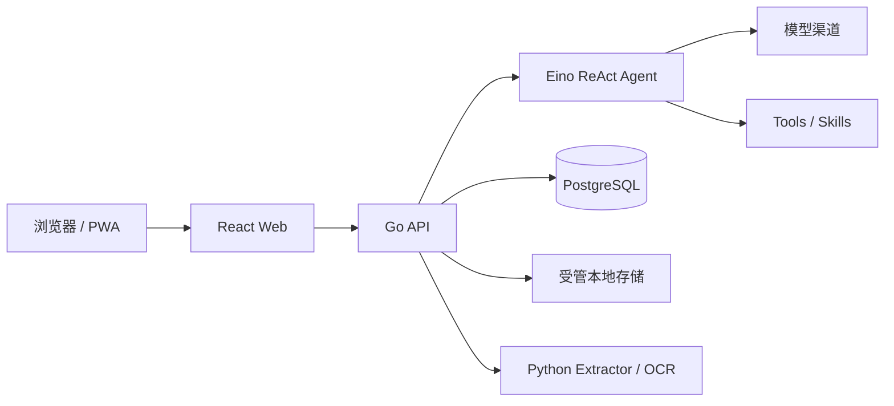

<p align="center">
  
</p>

<h1 align="center">EffChat</h1>

<p align="center">
  一个为真实工作链路而生的轻量、自托管 AI Agent 工作台。
</p>

<p align="center">
  <strong>中文</strong> · <a href="README.en.md">English</a>
</p>

<p align="center">
  <a href="https://github.com/huoguojun123/EffChat/actions/workflows/ci.yml"></a>
  <a href="https://github.com/huoguojun123/EffChat/releases"></a>
  <a href="LICENSE"></a>
  
  
</p>

EffChat 面向希望掌控模型、数据和运行边界的个人与小团队。它保持部署简单、界面安静，但没有把复杂问题藏在一个聊天输入框后面：流式运行可以在断线后恢复，回答版本可以切换，长对话可以压缩而不抹去历史，文件、记忆和联网工具都拥有明确的生命周期与失败语义。

> [!WARNING]
> 当前版本为 `v0.3.4-beta.3`。EffChat 仍处于测试阶段，升级前请先完成一致备份；数据迁移、配置兼容性和公开 API 仍可能在后续测试版中调整。

## 为什么是 EffChat

### 对话不是一次 HTTP 请求

- **断线仍继续**：浏览器断开后，后端运行继续完成并落库；刷新或重新连接后通过 RunHub 与数据库恢复。
- **回答可以比较**：同一轮的多个回答 attempt 会被持久化，可以左右切换和删除；发送给下一轮的始终是当前选中的版本。
- **重试不制造重复事实**：零输出故障可以安全重试，已经产生正文、思考或工具输出后不会偷偷重放 provider 调用。
- **压缩不等于删除历史**：checkpoint 只改变模型看到的上下文，用户仍能回看压缩前的完整消息。

### 文件真正进入 Agent 工作流

- 上传、暂存认领、解析文本、会话文件区、预览和鉴权下载共享同一套所有权边界。
- 本地 Python sidecar 处理常见文档和表格；PDF 可选 MinerU 精准 OCR，并保留本地解析兜底。
- 大文件按窗口读取，提取、OCR、删除和清理都有明确状态，不把半成品内容交给 Agent。

### 记忆保持克制

- 记忆限定在单个会话内，不建立跨会话用户画像、向量库或隐式 RAG。
- 支持自动维护、手动整理、失败重试、变更记录和撤销。
- 密码、Token、Authorization、私钥等敏感内容在写入和再次上送模型前受到统一保护。

### 联网能力可以拆开治理

- 搜索与网页提取是两条独立工具链，可以分别启停、排序和限额。
- Firecrawl、Jina、Tavily Extract、Exa Extract 等 provider 按管理员顺序执行，Basic 作为无需凭据的本地末级兜底。
- 长正文先做本地相关内容选择；模型提炼可以关闭，失败时回退相关原文，而不是简单截取页面开头。

### 从模型到配额都可见、可控

- 支持 OpenAI-compatible Chat Completions、OpenAI Responses、Anthropic native 和 Google native 适配。
- 模型、渠道、Tools、Skills、联网服务、用户组、配额、字体和系统配置均由管理后台治理。
- 消息、模型 Token、工具、搜索、网页提取和 OCR 用量拥有统一统计口径，但不伪装成商业计费系统。

## 架构一览



- **Backend**：Go、Gin、Eino
- **Frontend**：React 19、TypeScript、Vite、Tailwind CSS v4
- **Database**：PostgreSQL
- **Extractor**：隔离的 Python sidecar
- **Deployment**：Docker Compose

完整设计与运行不变量见 [架构文档](ARCHITECTURE.md)。

## 快速开始

### 使用已发布镜像

适合希望直接运行 EffChat、无需在部署机编译前后端的用户：

```bash
git clone https://github.com/huoguojun123/EffChat.git
cd EffChat
cp .env.docker.example .env.docker
# 至少替换 POSTGRES_PASSWORD 和 JWT_SECRET
docker compose --env-file .env.docker -f docker-compose.registry.yml pull
docker compose --env-file .env.docker -f docker-compose.registry.yml up -d
```

### 从源码构建

```bash
git clone https://github.com/huoguojun123/EffChat.git
cd EffChat
cp .env.docker.example .env.docker
# 至少替换 POSTGRES_PASSWORD 和 JWT_SECRET
scripts/docker-build.sh up
```

启动后访问 `http://localhost:8088`。新实例注册的首个用户会自动成为管理员，然后可在管理后台配置模型渠道、联网服务、工具、用户组和文件策略。

升级、备份、恢复、数据目录和反向代理配置见 [Docker Compose 部署](docs/deployment.md)。

## 文档

- [管理员配置](docs/administration.md)：模型、渠道、联网服务、记忆容量、配额、字体与文件治理。
- [Docker Compose 部署](docs/deployment.md)：镜像部署、源码构建、升级、备份与隔离恢复。
- [架构文档](ARCHITECTURE.md)：核心数据流、恢复契约、文件、记忆、Agent 与治理边界。
- [贡献指南](CONTRIBUTING.md)：开发环境、验证命令和 Pull Request 规则。
- [数据库迁移](backend/migrations/README.md)：migration runner、升级规则与故障处理。
- [版本记录](CHANGELOG.md)：测试版变化与兼容性说明。

## 当前边界

EffChat 当前专注于自托管 Agent 工作台，不包含代码执行沙盒、Shell 工具、浏览器自动化、完整 RBAC、商业账单或 Skills marketplace。这些能力会显著扩大安全和部署边界，不会以未经治理的开关形式塞进主进程。

## 安全与贡献

- 安全漏洞请通过 [GitHub Private Vulnerability Reporting](https://github.com/huoguojun123/EffChat/security/advisories/new) 私下报告，不要公开创建 Issue。
- Bug 报告、功能建议和代码贡献请先阅读 [CONTRIBUTING.md](CONTRIBUTING.md)。
- 示例、测试和 Issue 中不得包含真实凭据、生产日志、用户数据或私有部署信息。

## 许可证

EffChat 自有源码采用 [Apache License 2.0](LICENSE)。第三方依赖、提示词和素材继续遵循各自许可证，详见 [THIRD_PARTY_NOTICES.md](THIRD_PARTY_NOTICES.md) 与 [NOTICE](NOTICE)。发布镜像同时携带从实际分发依赖生成的组件级许可归档。

面向维护者的发布门禁见 [发布检查清单](docs/release-checklist.md)。
