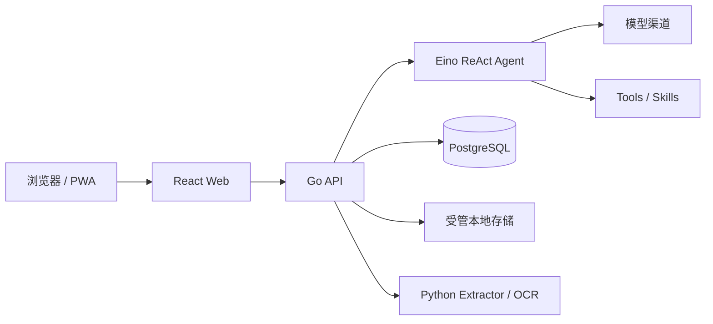

<p align="center">
  
</p>

<h1 align="center">EffChat</h1>

<p align="center">
  把模型、数据与 Agent 运行掌握在自己手里的自托管工作台。
</p>

<p align="center">
  <strong>中文</strong> · <a href="README.en.md">English</a>
</p>

<p align="center">
  <a href="https://github.com/huoguojun123/EffChat/actions/workflows/ci.yml"></a>
  <a href="https://github.com/huoguojun123/EffChat/releases"></a>
  <a href="LICENSE"></a>
  
  
</p>

<p align="center">
  <a href="#快速开始">快速开始</a> ·
  <a href="#界面预览">界面预览</a> ·
  <a href="#能力一览">功能</a> ·
  <a href="#文档地图">文档</a>
</p>

EffChat 面向希望掌控模型、数据与运行边界的个人和小团队。它保持部署入口简单、界面安静，也认真处理聊天框背后的复杂问题：流式运行恢复、可切换的回答版本、保留历史的上下文压缩，以及文件、记忆、联网工具和治理配置的完整生命周期。

> [!WARNING]
> EffChat 目前仍处于测试阶段。升级前请先按部署文档完成一致备份；后续预发布版本仍可能调整 migration、配置兼容性和公开 API。

## 能力一览

| 领域 | EffChat 提供什么 |
| --- | --- |
| 对话与恢复 | Eino ReAct Agent、流式思考与工具调用、断线后继续运行、刷新恢复、零输出安全重试 |
| 回答与上下文 | 同轮多回答切换和删除、选中回答进入后续上下文、数据库 checkpoint、保留压缩前历史 |
| 文件与理解 | 上传和会话认领、PDF/Office/Markdown/表格提取、图片原件与视觉输入、预览与鉴权下载、可选 OCR、大文件窗口读取 |
| 记忆 | 单会话结构化记忆、自动维护、手动整理、失败重试、变更记录与撤销、敏感值保护 |
| 联网工具 | 搜索与网页提取独立治理、第三方 provider 顺序、本地 Basic 兜底、长正文筛选、可选模型提炼 |
| 模型与治理 | 多协议模型渠道、Tools/Skills、用户组、配额、用量、文件策略、联网服务、字体与实例状态 |

## 界面预览

<p align="center">
  <a href="docs/assets/screenshots/chat-workspace.png">
    
  </a><br>
  <sub>对话工作台：流式回答、Markdown 与 Mermaid 预览、会话组织和运行状态集中在同一界面。</sub>
</p>

<p align="center">
  <a href="docs/assets/screenshots/file-and-tools.png">
    
  </a><br>
  <sub>文件与工具链：上传多份 PDF 后，Agent 可以搜索、读取并展示可回溯的工具运行过程。</sub>
</p>

<p align="center">
  <a href="docs/assets/screenshots/admin-settings.png">
    
  </a><br>
  <sub>管理后台：集中配置协议、渠道、模型能力、启停状态和连接检查。</sub>
</p>

点击图片可以查看原始尺寸。截图只使用演示内容或已脱敏配置，不是可直接复用的生产设置。

## 关键设计

### 对话不是一次 HTTP 请求

- **断线仍继续**：浏览器断开后，后端运行继续完成并落库；刷新或重新连接后通过 RunHub 与数据库恢复。
- **回答可以比较**：同一轮的多个回答 attempt 会被持久化，可以左右切换和删除；发送给下一轮的始终是当前选中的版本。
- **重试不制造重复事实**：零输出故障可以安全重试；已经产生正文、思考或工具输出后不会偷偷重放 provider 调用。
- **压缩不删除历史**：checkpoint 只改变模型看到的上下文，用户仍能回看压缩前的完整消息；最近消息在预算内保留，超长内容按边界收敛。

### 文件真正进入 Agent 工作流

- 上传、暂存认领、解析文本、会话文件区、预览和鉴权下载共享同一套所有权边界。
- 隔离的 Python sidecar 处理常见文档和表格；图片保留受管原件并可进入支持视觉输入的模型，PDF 可选 MinerU 精准 OCR，并保留本地解析兜底。
- 大文件按窗口读取，提取、OCR、删除和清理都有明确状态，不把半成品内容交给 Agent。
- 文件大小、页数、解析并发、OCR 和保留周期由管理员统一治理，而不是散落在客户端配置中。

### 记忆保持克制且可撤销

- 记忆限定在单个会话内，不建立跨会话用户画像、向量库或隐式 RAG。
- 支持自动维护、手动整理、失败重试、变更记录和撤销；维护操作与普通消息运行分开记账。
- 密码、Token、Authorization、私钥等敏感内容在写入和再次上送模型前受到统一保护。

### 联网搜索与网页提取分开治理

- 搜索与网页提取是两条独立工具链，可以分别启停、排序和限额。
- Firecrawl、Jina、Tavily Extract、Exa Extract 等 provider 按管理员保存顺序执行；Basic 是无需凭据的最后本地兜底。
- Basic 使用正文抽取和相关段落选择处理长页面；模型提炼可以关闭，失败时回退相关原文，而不是只截取页面开头。
- 取消、超时、内容受限和降级结果使用明确状态，不把挑战页或空正文伪装成成功提取。

### 模型、工具与配额保持可见

- 支持 OpenAI-compatible Chat Completions、OpenAI Responses、Anthropic native 和 Google native 适配。
- 模型、渠道、Tools、Skills、联网服务、用户组、配额、字体和系统配置均由管理后台治理。
- 消息、模型 Token、工具、搜索、网页提取和 OCR 用量拥有统一统计口径，但不伪装成商业计费系统。
- 管理操作保留审计与并发更新边界，避免多个标签页或迟到响应悄悄覆盖新配置。

## 架构一览



- **Backend**：Go、Gin、Eino
- **Frontend**：React 19、TypeScript、Vite、Tailwind CSS v4
- **Database**：PostgreSQL
- **Extractor**：隔离的 Python sidecar
- **Deployment**：一个 EffChat 应用镜像按 `web`、`backend`、`extractor`、`migrate` 角色运行；PostgreSQL 使用官方独立镜像

完整数据流、目录职责和运行不变量见 [架构文档](ARCHITECTURE.md)。

## 快速开始

### 一条命令部署

适合个人实例。脚本会提示选择安装目录、Web 端口和数据库来源，生成本地随机密钥，下载同一测试版的 Compose，拉取一个 EffChat 应用镜像并启动。默认一并启动专用 PostgreSQL，也可连接已有 PostgreSQL：

```bash
curl -fsSL https://raw.githubusercontent.com/huoguojun123/EffChat/main/scripts/install.sh | bash
```

默认访问 `http://127.0.0.1:8088`。也可以预先设置安装目录或端口，跳过对应询问：

```bash
curl -fsSL https://raw.githubusercontent.com/huoguojun123/EffChat/main/scripts/install.sh | EFFCHAT_HOME=/srv/effchat EFFCHAT_WEB_PORT=8088 bash
```

安装目录最终只有一个活动 `.env`、一个 `compose.yml` 和运行数据。更新已有 EffChat 部署时，重新运行同一脚本并输入 `update`；脚本会保留端口、项目名、未知配置、JWT、数据库凭据及 data/storage/backups，只替换受控部署文件，并把旧 Compose、环境入口和宿主机 migration 归档到 `deployment-backups/`。应用 migration 已随镜像发布，不再要求部署目录长期保留 SQL 文件。

### 使用 Docker Compose 与已发布镜像

适合希望自己管理目录、环境变量、端口、升级与备份的用户：

```bash
git clone https://github.com/huoguojun123/EffChat.git
cd EffChat
cp .env.docker.example .env.docker
# 至少替换 POSTGRES_PASSWORD 和 JWT_SECRET
docker compose --env-file .env.docker -f docker-compose.registry.yml pull
docker compose --env-file .env.docker -f docker-compose.registry.yml up -d
```

该模板的 `web`、`backend`、`py-extractor` 和一次性 `migrate` 服务共用同一个 `gjhuo/effchat` 镜像，但仍是职责隔离的独立容器。默认 `COMPOSE_PROFILES=bundled-db` 启动官方 `postgres:17`；接入外部 PostgreSQL 时关闭该 profile，并填写 `DATABASE_URL` 或 `DB_*`。

### 从本地源码构建完整栈

源码方式仍使用相同的数据和 migration 契约，只把统一 EffChat 应用镜像改为本机构建：

```bash
git clone https://github.com/huoguojun123/EffChat.git
cd EffChat
cp .env.docker.example .env.docker
# 至少替换 POSTGRES_PASSWORD 和 JWT_SECRET
scripts/docker-build.sh up
```

常用命令：

```bash
scripts/docker-build.sh config  # 检查最终 Compose
scripts/docker-build.sh build   # 只构建统一应用镜像
scripts/docker-build.sh logs    # 查看服务日志
scripts/docker-build.sh down    # 停止服务，不删除数据卷
```

启动后访问 `http://localhost:8088`。新实例注册的首个用户会自动成为管理员，然后可在管理后台配置模型渠道、联网服务、工具、用户组和文件策略。

### 首次配置：模型、联网与文档提取

EffChat 自带本地文档提取和 Basic 网页正文兜底，但不内置模型、搜索或商业 OCR 额度。部署完成后，管理员按实际需要完成以下配置：

- **模型渠道**：填写兼容协议、Base URL、API Key、模型标识与能力；保存前可以先执行连接测试。至少配置一个可用模型后才能开始正常对话。
- **联网搜索**：可配置 Tavily、Brave Search、Exa、博查等服务的自有 Key，或连接自行部署的 SearXNG。SearXNG 必须开放 JSON 搜索格式，API Key 可选。
- **网页提取**：Firecrawl、Jina Reader、Tavily Extract 和 Exa Extract 独立配置并按管理员顺序运行；Tavily/Exa 的搜索与提取是两条独立配置，不共享启停状态。Basic 只负责已知 URL 的最后本地正文兜底，不替代搜索引擎生成搜索结果。
- **本地文档提取**：默认文件管线不需要外部 Key。隔离的 Python extractor 处理 PDF、DOCX、PPTX、XLSX 和 CSV；Markdown 与文本由本地管线直接读取，图片保留原件并在模型支持视觉输入时进入会话。文件认领、鉴权和清理由后端统一管理。
- **精准 PDF OCR**：扫描件或复杂版面可以在“渠道与联网服务”中配置 MinerU Token、Base URL 和最大并发。未配置 MinerU 时，普通本地解析仍可使用；OCR 失败也不会把未完成内容交给 Agent。
- **Tools、Skills 与配额**：管理员决定哪些工具和 Skills 可用，并通过用户组设置消息、Token、并发运行、工具、搜索、网页提取和 OCR 限额。

没有配置或没有启用的外部 provider 不会参与运行。凭据通过管理后台保存，不应写入公开仓库、截图、Issue 或示例环境文件；编辑时留空不会回显或覆盖已经保存的 Key。完整字段、文件限制、OCR 生命周期和排序规则见 [管理员配置](docs/administration.md)。

升级、备份、恢复、数据目录、反向代理和拆分开发方式见 [Docker Compose 部署](docs/deployment.md) 与 [贡献指南](CONTRIBUTING.md)。

## 文档地图

| 文档 | 适用场景 |
| --- | --- |
| [管理员配置](docs/administration.md) | 模型、渠道、联网服务、记忆容量、配额、字体和文件治理 |
| [Docker Compose 部署](docs/deployment.md) | 安装、源码构建、升级、备份、恢复、数据目录和反向代理 |
| [架构文档](ARCHITECTURE.md) | Agent、SSE/RunHub、文件、记忆、数据库和治理边界 |
| [贡献指南](CONTRIBUTING.md) | 开发环境、变更边界、验证命令和 Pull Request 规则 |
| [数据库迁移](backend/migrations/README.md) | migration runner、升级规则与故障处理 |
| [版本记录](CHANGELOG.md) | 测试版变化、兼容性和安全修正 |
| [安全策略](SECURITY.md) | 支持范围与私密漏洞报告 |

## 当前边界

EffChat 当前专注于自托管 Agent 工作台，不包含代码执行沙盒、Shell 工具、浏览器自动化、完整 RBAC、商业账单或 Skills marketplace。这些能力会显著扩大安全和部署边界，不会以未经治理的开关形式塞进主进程。

## 贡献与安全

- Bug 报告、功能建议和代码贡献请先阅读 [CONTRIBUTING.md](CONTRIBUTING.md)。大型功能先讨论维护边界；一个 Pull Request 聚焦一条完整根因链。
- 安全漏洞请通过 [GitHub Private Vulnerability Reporting](https://github.com/huoguojun123/EffChat/security/advisories/new) 私下报告，不要公开创建 Issue。
- 示例、测试、Issue、截图和日志不得包含真实凭据、用户数据、生产地址或私有部署信息。
- 新增依赖、提示词、字体、图标或素材时，必须同时保留来源、精确版本、许可证和必要署名。

## 许可证与第三方声明

EffChat 自有源码采用 [Apache License 2.0](LICENSE)。该许可证不替代第三方组件、提示词、图标、字体、素材、容器基础镜像或商标各自的许可条款。

- 项目级归属与必要声明见 [NOTICE](NOTICE)。
- 分发依赖、提示词来源和容器基础镜像见 [THIRD_PARTY_NOTICES.md](THIRD_PARTY_NOTICES.md)。
- 发布镜像在 `/usr/share/licenses/effchat/` 内携带按实际分发组件生成的许可证、版权与校验归档。

面向维护者的首次公开与发版门禁见 [发布检查清单](docs/release-checklist.md)。
